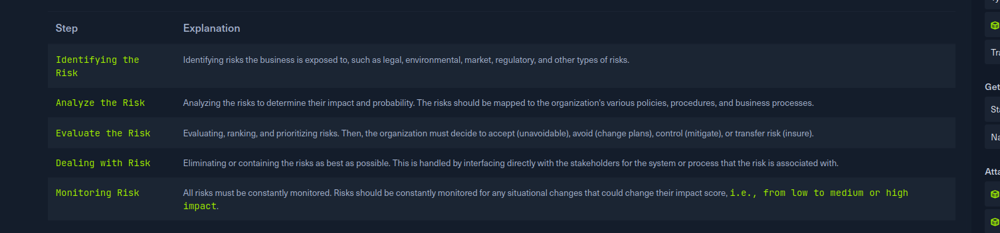

# InfoSec Overview

**Inofsec :** the practice of protecting data from unathorized acces, changes, unlawful use, disruption, etc

Data can be elctronic or physical and tangible or non tangible

# Risk management proccess

